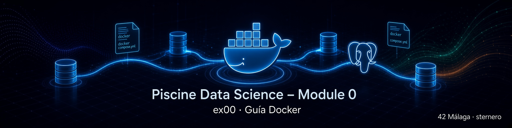

# 🐳 Guía Docker – EX00 y la Piscine Data Science

<p align="center">
  
</p>

[← Volver al README de EX00](README.md) · [← README principal](../README.md)

---

## 📑 Índice

1. [¿Para quién es esta guía?](#-para-quién-es-esta-guía)
2. [El objetivo de esta guía](#-el-objetivo-de-esta-guía)
3. [¿Qué problema resuelve Docker?](#-qué-problema-resuelve-docker)
4. [Ideas clave: imagen, contenedor, volumen, red](#-ideas-clave-imagen-contenedor-volumen-red)
5. [¿Qué es Docker Compose?](#-qué-es-docker-compose)
6. [Por qué Docker en EX00](#-por-qué-docker-en-ex00)
7. [Anatomía de un `docker-compose.yml` (PostgreSQL)](#-anatomía-de-un-docker-composeyml-postgresql)
8. [Archivo `.env` y buenas prácticas](#-archivo-env-y-buenas-prácticas)
9. [Comandos esenciales del día a día](#-comandos-esenciales-del-día-a-día)
10. [Ciclo de vida: arrancar, parar, borrar](#-ciclo-de-vida-arrancar-parar-borrar)
11. [`docker exec` y PostgreSQL](#-docker-exec-y-postgresql)
12. [Copiar archivos al contenedor (`docker cp`)](#-copiar-archivos-al-contenedor-docker-cp)
13. [Persistencia de datos (muy importante)](#-persistencia-de-datos-muy-importante)
14. [Buenas prácticas en el campus 42](#-buenas-prácticas-en-el-campus-42)
15. [Errores frecuentes](#-errores-frecuentes)
16. [Mapa con el resto del módulo](#-mapa-con-el-resto-del-módulo)
17. [Mini glosario](#-mini-glosario)
18. [Navegación](#-navegación)

---

## 👋 ¿Para quién es esta guía?

Para cualquier persona de la **Piscine Data Science** en 42 que:

- vaya a montar PostgreSQL con **Docker / Docker Compose** en EX00,
- no tenga clara la diferencia entre imagen, contenedor y volumen,
- necesite comandos fiables sin memorizar toda la documentación oficial,
- quiera evitar borrados accidentales de datos.

Es **genérica**: sirve para cualquier login.  
Donde veas **`tu_login`** (sustituye por tu login) o usa **`$(whoami)`** (que cogerá tu login del sistema).

[↑ Volver al índice](#-índice)

---

## 🎯 El objetivo de esta guía

Al terminarla deberías poder:

1. Explicar **qué es** Docker en una frase útil.  
2. Distinguir **imagen**, **contenedor** y **volumen**.  
3. Leer un `docker-compose.yml` mínimo de PostgreSQL.  
4. **Arrancar**, **comprobar**, **parar** y **reiniciar** el servicio.  
5. Saber cuándo un comando **borra datos** y cuándo no.  
6. Usar `docker exec` y `docker cp` con sentido en EX00–EX02.

No es un curso completo de Docker.  
Es el **kit mínimo** para no atascarte en esta piscine.

[↑ Volver al índice](#-índice)

---

## 🧩 ¿Qué problema resuelve Docker?

Sin Docker, cada persona instalaría PostgreSQL de forma distinta:

- versiones diferentes,
- rutas distintas,
- problemas de permisos (`sudo`),
- “en mi máquina funciona... ¿Por qué en la tuya no?”.

**Docker** empaqueta una aplicación (aquí, PostgreSQL) con su entorno en una **caja reproducible**.

Analogía:

| Idea | Comparación |
|------|-------------|
| Imagen | Receta / plano de la caja |
| Contenedor | La caja ya montada y en marcha |
| Volumen | Un cajón externo donde guardas lo importante |
| `docker-compose.yml` | Instrucciones para montar el escenario completo |

Docker permite que **todo el mundo** tenga el mismo PostgreSQL 15 sin tener que instalarlo a mano en el sistema.

[↑ Volver al índice](#-índice)

---

## 🧱 Ideas clave: imagen, contenedor, volumen, red

### Imagen (*image*)

Plantilla de solo lectura. Ejemplo: `postgres:15`.

```bash
# Docker la descarga la primera vez que la necesitas
docker-compose up -d
```

### Contenedor (*container*)

Instancia en ejecución (o detenida) creada a partir de una imagen.

En este proyecto suele llamarse, por ejemplo:

```text
postgres_piscineds
```

### Volumen (*volume*)

Almacenamiento **persistente** fuera del ciclo de vida efímero del contenedor.

Si solo borras el contenedor pero **conservas el volumen**, las bases y tablas siguen ahí.

### Red (*network*)

Canal por el que los contenedores se hablan entre sí.  
Con un solo servicio PostgreSQL casi no la tocas; Compose crea una red por defecto.

```text
imagen postgres:15
        ↓  (docker-compose up)
contenedor postgres_piscineds
        ↓
volumen postgres_data  →  datos de /var/lib/postgresql/data
        ↓
puerto 5432 publicado en localhost
```

[↑ Volver al índice](#-índice)

---

## 📦 ¿Qué es Docker Compose?

**Docker Compose** es la herramienta para definir y levantar **uno o varios** servicios con un fichero YAML.

En EX00 normalmente hay **un solo servicio**: PostgreSQL.

| Sin Compose | Con Compose |
|-------------|-------------|
| Largos `docker run` con muchos flags | Un archivo `docker-compose.yml` legible |
| Fácil olvidar puertos o variables | Todo versionado en el repo |
| Menos claro para el evaluador | El subject acepta `docker-compose.yml` como entregable |

Comandos típicos (en la carpeta del `docker-compose.yml`):

```bash
docker-compose up -d
docker-compose ps
docker-compose stop
docker-compose down
docker-compose down -v
```

> En instalaciones recientes el comando puede ser `docker compose` (sin guion).  
> Por lo generar suele funcionar `docker-compose`. Prueba ambos si uno no lo hace.

[↑ Volver al índice](#-índice)

---

## 🎓 Por qué Docker en EX00

El subject permite:

- PostgreSQL ya instalado en la máquina,
- una VM,
- o **Docker Compose**.

Docker es el camino más **homogéneo** en 42:

| Ventaja | Detalle |
|---------|---------|
| Reproducible | Misma imagen `postgres:15` para todos |
| Sin `sudo` para instalar Postgres en el host | El motor vive en el contenedor |
| Alineado con Inception | `.env`, no hardcodear secretos, volúmenes |
| Portable | El mismo `docker-compose.yml` en otra sesión |

Tu entregable típico en `ex00/`:

```text
docker-compose.yml
```

(podríamos decidir acompañarlo de scripts de ayuda y .md, pero el subject pide **uno** de: compose / `setup.sh` / `VM-instructions.txt`, así que: mejor **entregar solamente el fichero que nos piden**).

[↑ Volver al índice](#-índice)

---

## 📄 Anatomía de un `docker-compose.yml` (PostgreSQL)

Ejemplo mínimo válido (sin comentarios):

```yaml
services:
  postgres:
    image: postgres:15
    container_name: postgres_piscineds
    environment:
      POSTGRES_USER: ${POSTGRES_USER}
      POSTGRES_PASSWORD: ${POSTGRES_PASSWORD}
      POSTGRES_DB: ${POSTGRES_DB}
    ports:
      - "5432:5432"
    volumes:
      - postgres_data:/var/lib/postgresql/data
    restart: unless-stopped

volumes:
  postgres_data:
```

### Qué significa cada bloque

| Clave | Significado |
|-------|-------------|
| `services` | Lista de servicios a levantar |
| `postgres` | Nombre del servicio dentro de Compose |
| `image: postgres:15` | Imagen oficial, versión 15 |
| `container_name` | Nombre fijo del contenedor (más cómodo en `docker ps`) |
| `environment` | Usuario, contraseña y base creados al **primer** arranque |
| `ports` | `puerto_en_tu_máquina:puerto_en_el_contenedor` |
| `volumes` | Persistencia de los ficheros de PostgreSQL |
| `restart: unless-stopped` | Reinicia solo si no lo paraste tú a propósito |
| `volumes:` (al final) | Declaración del volumen nombrado |

### Sobre la línea `version:`

En Compose moderno la clave `version:` es **obsoleta** y se puede omitir.  
Si la dejas y aparece un *warning*, no suele impedir el arranque; pero también puedes quitarla (recomendado).

### Variables `${...}`

Leen valores del entorno o de un archivo **`.env`** en la misma carpeta.  
Así no escribes la contraseña dentro del YAML (buena práctica tipo Inception).

[↑ Volver al índice](#-índice)

---

## 🔐 Archivo `.env` y buenas prácticas

Ejemplo de `.env` para esta piscine:

```bash
POSTGRES_USER=tu_login
POSTGRES_PASSWORD=mysecretpassword
POSTGRES_DB=piscineds
```

Creación rápida (usuario = login del sistema):

```bash
echo "POSTGRES_USER=$(id -un)
POSTGRES_PASSWORD=mysecretpassword
POSTGRES_DB=piscineds" > .env
```

Protección en Git:

```bash
echo ".env" >> .gitignore
```

| Buena práctica | Por qué |
|----------------|---------|
| Credenciales en `.env` | No hardcodear en el compose |
| `.env` en `.gitignore` | Impide subir secretos al repo |
| Misma contraseña del subject | `mysecretpassword` es única y obligatoria |
| Usuario = «tu_login« | También obligario. |

**Importante:** `POSTGRES_USER` / `POSTGRES_DB` se aplican sobre todo cuando el **volumen se crea por primera vez**.  
Si cambias el `.env` pero reutilizas un volumen antiguo, puedes ver usuarios o bases “viejas”. En ese caso hace falta recrear el volumen (destructivo) o gestionar usuarios a mano.

[↑ Volver al índice](#-índice)

---

## ⌨️ Comandos esenciales del día a día

Ejecuta estos comandos **desde la carpeta donde está tu `docker-compose.yml`** (salvo que indiques otra ruta).

### Arrancar

```bash
docker-compose up -d
```

`-d` = *detached* (en segundo plano, así puedes seguir trabajando en la misma terminal).

### ¿Está corriendo?

```bash
docker ps
docker-compose ps
```

Busca el nombre del contenedor y el puerto `0.0.0.0:5432->5432/tcp`.

### Logs

```bash
docker logs postgres_piscineds
docker logs --tail 20 postgres_piscineds
docker logs -f postgres_piscineds
```

`-f` sigue el log en vivo (Ctrl+C para dejar de seguir; **no** apaga el contenedor).

### Parar sin borrar datos

```bash
docker-compose stop
# o
docker stop postgres_piscineds
```

### Parar y eliminar contenedor/red (volumen se conserva por defecto)

```bash
docker-compose down
```

### ⚠️ Parar y eliminar también volúmenes (¡borra datos de PostgreSQL!)

```bash
docker-compose down -v
```

Usa `-v` solo cuando quieras un **reset total**.

[↑ Volver al índice](#-índice)

---

## 🔄 Ciclo de vida: arrancar, parar, borrar

| Acción | Comando típico | ¿Se pierden tablas/datos? |
|--------|----------------|---------------------------|
| Arrancar | `docker-compose up -d` | No |
| Ver estado | `docker ps` | No |
| Parar | `docker-compose stop` | No |
| Quitar contenedor | `docker-compose down` | No (si el volumen sigue) |
| ⚠️ Reset total | `docker-compose down -v` | **Sí** |

Regla práctica:

- Cerrar el portátil / parar el contenedor → **los datos pueden permanecer** en el volumen.  
- `down -v` o borrar el volumen a mano → **empiezas de cero**.

[↑ Volver al índice](#-índice)

---

## 🛠️ `docker exec` y PostgreSQL

`docker exec` ejecuta un comando **dentro** de un contenedor en marcha.

Conexión habitual a `psql` sin tener el cliente en el host:

```bash
docker exec -it postgres_piscineds \
  psql -U "$(whoami)" -d piscineds -W
```

| Flag | Significado |
|------|-------------|
| `-i` | Entrada interactiva |
| `-t` | Terminal |
| `postgres_piscineds` | Contenedor destino |

Otros ejemplos útiles:

```bash
# ¿PostgreSQL acepta conexiones?
docker exec postgres_piscineds pg_isready -U "$(whoami)" -d piscineds

# Variables de entorno del contenedor
docker exec postgres_piscineds env | grep POSTGRES
```

Más detalle de `psql` en [postgresql.md](./postgresql.md).

[↑ Volver al índice](#-índice)

---

## 📂 Copiar archivos al contenedor (`docker cp`)

PostgreSQL, al hacer `COPY FROM '/ruta/archivo.csv'`, lee rutas **del servidor** (dentro del contenedor), no de tu home automáticamente.

Por eso en EX02 es frecuente:

```bash
docker cp /ruta/en/tu/maquina/data_2022_dec.csv \
  postgres_piscineds:/tmp/data_2022_dec.csv
```

Comprobación:

```bash
docker exec postgres_piscineds ls -la /tmp/data_2022_dec.csv
```

### Aviso `Lchown` / `invalid argument`

En algunos entornos del campus `docker cp` muestra un error de `Lchown` **después** de copiar.  
Si `ls` dentro del contenedor ve el fichero con tamaño correcto, **puedes continuar**.

Alternativa: `\copy` desde `psql` en el host (el cliente lee el fichero local).  
Eso se detalla en la [guía SQL de EX02](../ex02/SQL.md).

[↑ Volver al índice](#-índice)

---

## 💾 Persistencia de datos (muy importante)

Los datos de PostgreSQL viven, con el compose de ejemplo, en:

```text
volumen Docker → montado en /var/lib/postgresql/data
```

| Operación | Efecto sobre los datos |
|-----------|-------------------------|
| `stop` / reinicio del PC (con `restart` y volumen intacto) | Suele conservarlos |
| `down` sin `-v` | Conserva el volumen |
| ⚠️ `down -v` | **Borra** el volumen y los datos |
| Borrar el volumen a mano | **Borra** los datos |

Para la piscine:

- Durante el trabajo diario: `stop` / `up -d` es suficiente.  
- Solo usa `-v` si quieres recrear usuario/base desde cero o estás seguro de no necesitar las tablas.

[↑ Volver al índice](#-índice)

---

## 🏫 Buenas prácticas en el campus 42

1. Trabaja el compose en una ruta con espacio (`sgoinfre` / proyecto del módulo).  
2. No subas `.env` a GitHub.  
3. Usa `container_name` fijo para no adivinar IDs en cada comando.  
4. Publica `5432:5432` si quieres el comando del subject con `-h localhost`.  
5. Comprueba `docker ps` **antes** de depurar SQL o pgAdmin.  
6. Documenta cómo arrancar (o usa el `start.sh`).  
7. Recuerda: el evaluador debe poder levantar tu entorno con lo entregado en `ex00/`.

[↑ Volver al índice](#-índice)

---

## 🛠️ Errores frecuentes

### `port is already allocated` / `bind: address already in use`

Otro proceso (u otro contenedor) usa el 5432.

```bash
docker ps
# detén el contenedor antiguo o cambia el puerto host en el compose (ej. "5433:5432")
```

Si cambias el puerto host, en `psql` / pgAdmin deberás usar ese puerto.

### `container name already in use`

```bash
docker-compose down
# o: docker rm -f postgres_piscineds
```

### `connection refused` a localhost:5432

El contenedor no está *Up* o el puerto no está publicado.

```bash
docker-compose up -d
docker ps
```

### Cambié el `.env` y el usuario no existe

El volumen antiguo se inicializó con otras credenciales.

- ⚠️ Solución destructiva: `docker-compose down -v` y volver a `up -d`.  
- Solo si puedes permitirte perder los datos.

### `docker-compose: command not found`

Prueba:

```bash
docker compose version
```

y usa `docker compose` en lugar de `docker-compose`.

### Aviso `version is obsolete`

Quita la línea `version:` del YAML. No afecta a la lógica del servicio, es sólo una molestia.

[↑ Volver al índice](#-índice)

---

## 🗺️ Mapa con el resto del módulo

| Recurso | Contenido |
|---------|-----------|
| [README EX00](README.md) | Setup del ejercicio, entregable, checklist |
| [postgresql.md](./postgresql.md) | Qué es PostgreSQL y cómo usar `psql` |
| [README EX01](../ex01/README.md) | Herramienta gráfica |
| [pgAdmin.md](../ex01/pgAdmin.md) | Conectar la UI a `localhost:5432` |
| [SQL.md](../ex02/SQL.md) | Tablas, tipos, `COPY`, `docker cp` |

Orden mental:

```text
Docker (esta guía) → PostgreSQL arriba → psql / pgAdmin → CREATE / COPY (EX02+)
```

[↑ Volver al índice](#-índice)

---

## 📖 Mini glosario

| Término | Significado breve |
|---------|-------------------|
| Docker | Plataforma de contenedores |
| Imagen | Plantilla inmutable del servicio |
| Contenedor | Instancia en ejecución de una imagen |
| Volumen | Almacenamiento persistente |
| Compose | Orquestación simple con YAML |
| `up -d` | Crear/arrancar en segundo plano |
| `down` | Parar y eliminar contenedores/redes del proyecto |
| `down -v` | Además elimina volúmenes (borra datos) |
| `exec` | Comando dentro de un contenedor en marcha |
| `cp` | Copiar ficheros host ↔ contenedor |
| Puerto 5432 | Puerto por defecto de PostgreSQL |
| `.env` | Variables de entorno para Compose |

[↑ Volver al índice](#-índice)

---

## 🔗 Navegación

- [← README de EX00](README.md)
- [← README principal](../README.md)
- [Guía PostgreSQL + psql](./postgresql.md)
- [Siguiente: EX01 →](../ex01/README.md)
- [Guía SQL EX02](../ex02/SQL.md)

---

<br>
<p align=center>
   Piscine Data Science – Module 0 – Guía Docker – Material didáctico genérico <br><br>
   sternero – 42 Málaga – septiembre 2026
</p>
