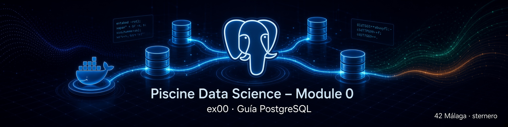

# 🐘 Guía PostgreSQL + psql – EX00 y la Piscine Data Science

<p align="center">
  
</p>

[← Volver al README de EX00](README.md) · [← README principal](../README.md)

---

## 📑 Índice

1. [¿Para quién es esta guía?](#-para-quién-es-esta-guía)
2. [El objetivo de esta guía](#-el-objetivo-de-esta-guía)
3. [¿Qué es una base de datos?](#-qué-es-una-base-de-datos)
4. [¿Qué es PostgreSQL?](#-qué-es-postgresql)
5. [Por qué PostgreSQL en esta piscine](#-por-qué-postgresql-en-esta-piscine)
6. [Piezas del sistema: servidor, cliente y base](#-piezas-del-sistema-servidor-cliente-y-base)
7. [¿Qué es psql?](#-qué-es-psql)
8. [Cómo encaja todo con EX00 (Docker)](#-cómo-encaja-todo-con-ex00-docker)
9. [Conectarse a PostgreSQL](#-conectarse-a-postgresql)
10. [Tu primera sesión en psql](#-tu-primera-sesión-en-psql)
11. [Comandos esenciales de psql](#-comandos-esenciales-de-psql)
12. [SQL mínimo que necesitas al empezar](#-sql-mínimo-que-necesitas-al-empezar)
13. [Buenas prácticas para no perderte](#-buenas-prácticas-para-no-perderte)
14. [Errores frecuentes al conectar](#-errores-frecuentes-al-conectar)
15. [Dónde sigue el aprendizaje](#-dónde-sigue-el-aprendizaje)
16. [Mini glosario](#-mini-glosario)
17. [Navegación](#-navegación)

---

## 👋 ¿Para quién es esta guía?

Para cualquier persona en la **Piscine Pedagógica de Data Science** de 42 que:

- vaya a hacer el **Module 0 – Creation of a DB**,
- no haya usado PostgreSQL (o casi no),
- necesite entender **qué es** el sistema y **cómo hablar** con `psql`,
- quiera una referencia clara, sin jerga innecesaria.

No hace falta experiencia previa en bases de datos.  
Sí hace falta seguir los requisitos exigidos para EX00 (crear la base con los datos obligatorios).

Esta guía es **genérica**: sirve para cualquier login.  
Donde diga *tu_login*, sustituye por tu usuario.

[↑ Volver al índice](#-índice)

---

## 🎯 El objetivo de esta guía

Al terminarla deberías poder responder, con tus palabras:

1. **Qué es** PostgreSQL y para qué sirve en este módulo.  
2. **Qué diferencia** hay entre el servidor PostgreSQL y el cliente `psql`.  
3. **Cómo conectarte** a la base `piscineds` (como pide el subject).  
4. **Cómo moverte** un poco dentro de `psql` sin miedo (`\q`, `\dt`, `\d`, un `SELECT` simple).  
5. **Dónde mirar** cuando algo falla (contenedor parado, contraseña, host…).

No pretende ser un manual oficial completo de PostgreSQL.  
Pretende ser el **mapa de orientación** para afrontar EX00 y los días siguientes de la piscine.

[↑ Volver al índice](#-índice)

---

## 🗄️ ¿Qué es una base de datos?

Una **base de datos** es un sistema organizado para **guardar, buscar y actualizar información** de forma fiable.

Analogía sencilla:

| Mundo real | En la base de datos |
|------------|---------------------|
| Almacén | Servidor de base de datos |
| Zona del almacén | Base de datos (`piscineds`) |
| Estantería | Tabla |
| Etiqueta del hueco | Columna (nombre del campo) |
| Caja concreta en un hueco | Fila (un registro) |

Sin base de datos, los CSV de la piscine serían solo ficheros sueltos.  
Con base de datos puedes **consultar**, **filtrar**, **unir** y **preparar** esos datos para análisis.

[↑ Volver al índice](#-índice)

---

## 🐘 ¿Qué es PostgreSQL?

**PostgreSQL** (a menudo *Postgres*) es un **sistema de gestión de bases de datos relacionales** de código abierto.

En la práctica significa:

- Guarda datos en **tablas** (filas y columnas).  
- Usa el lenguaje **SQL** para crear estructuras y hacer consultas.  
- Es muy usado en empresas, proyectos open source y formación.  
- Es **potente y estricto** con los tipos de datos (ideal para aprender bien).

Características que importan en la piscine:

| Idea | Por qué te importa |
|------|---------------------|
| Relacional | Los datos viven en tablas relacionadas entre sí |
| SQL estándar | Lo que aprendes aquí se parece a lo de otros motores |
| Tipos ricos | `TIMESTAMP`, `NUMERIC`, `UUID`, etc. (EX02 lo exige) |
| Cliente oficial `psql` | Terminal para hablar con el servidor |
| Muy documentado | Hay respuesta casi para cualquier error |

No necesitas instalar PostgreSQL “a mano” en el campus si usas **Docker** (camino recomendado en EX00): el contenedor ya trae el servidor listo.

[↑ Volver al índice](#-índice)

---

## 🎓 Por qué PostgreSQL en esta piscine

El Module 0 te pone en el rol de **Data Engineer** el primer día en una empresa de e-commerce:

- Te dejan ventas de varios meses en CSV.  
- Debes **guardarlas bien** en un almacén digital.  
- Más adelante se limpiarán y analizarán.

PostgreSQL es el almacén:

1. **EX00** → crear el almacén (`piscineds`) y poder entrar.  
2. **EX01** → verlo con una herramienta gráfica (pgAdmin u otra).  
3. **EX02–EX04** → crear tablas y cargar CSV.  
4. Días siguientes → limpiar, unir, consultar.

Si el cimiento (PostgreSQL + conexión) falla, el resto de la piscine se atasca.  
Por eso EX00 parece “poco código” pero es **crítico**.

[↑ Volver al índice](#-índice)

---

## 🧱 Piezas del sistema: servidor, cliente y base

Es fácil liarse con los nombres. Separa estas tres ideas:

```text
┌─────────────────────────────────────────┐
│  SERVIDOR PostgreSQL                    │
│  (el motor que guarda y procesa datos)  │
│                                         │
│    ┌─────────────────────────────┐      │
│    │  Base de datos: piscineds   │      │
│    │  (tablas, datos, usuarios)  │      │
│    └─────────────────────────────┘      │
└─────────────────────────────────────────┘
                 ▲
                 │  conexión (puerto 5432)
                 │
         ┌───────┴────────┐
         │  CLIENTE psql  │  ← tú, en la terminal
         └────────────────┘
```

| Pieza | Qué es | Ejemplo en EX00 |
|-------|--------|------------------|
| **Servidor** | Programa que gestiona los datos | Proceso dentro del contenedor `postgres_piscineds` |
| **Base de datos** | “Carpeta lógica” de tablas | `piscineds` |
| **Cliente** | Programa con el que te conectas | `psql` (en el host o dentro del contenedor) |
| **Usuario** | Identidad con permisos | Tu login |
| **Contraseña** | Credencial del usuario | `mysecretpassword` (obligatoria en el subject) |

También existe una interfaz **gráfica** (pgAdmin, DBeaver…): es otro *cliente*, no sustituye al servidor.

[↑ Volver al índice](#-índice)

---

## 💻 ¿Qué es psql?

**`psql`** es el **cliente oficial en terminal** de PostgreSQL.

- Te conectas al servidor.  
- Escribes comandos SQL (`SELECT ...;`).  
- Usas atajos propios de `psql` que empiezan por `\` (por ejemplo `\q` para salir).

### Servidor ≠ psql

| | Servidor PostgreSQL | Cliente `psql` |
|--|---------------------|----------------|
| ¿Qué hace? | Guarda y procesa datos | Te permite hablar con el servidor |
| ¿Dónde vive en EX00? | Dentro del contenedor Docker | En el contenedor (siempre) y/o en tu host (si lo instalas) |
| ¿Lo pide el subject? | Sí (la base debe existir) | Sí (el comando de conexión usa `psql`) |

En muchos ordenadores del campus **no** está `psql` instalado en el sistema.  
La imagen Docker `postgres:15` **sí** trae `psql` dentro. Por eso es habitual conectarse así:

```bash
docker exec -it postgres_piscineds psql -U "$(whoami)" -d piscineds -W
```

Eso significa: *entra en el contenedor y ahí ejecuta psql*.

[↑ Volver al índice](#-índice)

---

## 🐳 Cómo encaja todo con EX00 (Docker)

El subject permite PostgreSQL instalado en la máquina, en una VM, o con **Docker Compose**.

#### 🐳 Guía Docker: [docker.md](./docker.md)

En el camino Docker típico de este módulo:

| Elemento del subject | Valor |
|----------------------|--------|
| Usuario | Tu login de estudiante |
| Base de datos | `piscineds` |
| Contraseña | `mysecretpassword` |
| Conexión esperada | `psql -U tu_login -d piscineds -h localhost -W` |

Con Docker Compose sueles tener:

- Un servicio basado en la imagen `postgres:15`.  
- Un contenedor con nombre reconocible (p. ej. `postgres_piscineds`).  
- Puerto **5432** publicado en `localhost`.  
- Variables de entorno (`POSTGRES_USER`, `POSTGRES_PASSWORD`, `POSTGRES_DB`), a menudo en un archivo `.env`.  
- Un **volumen** para que los datos no se borren al reiniciar el contenedor.

Flujo mental:

```text
docker-compose up -d
        ↓
  Servidor PostgreSQL escuchando en localhost:5432
        ↓
  psql (host o docker exec) se conecta
        ↓
  Trabajas dentro de la base piscineds
```

Detalles de implementación (`docker-compose.yml`, `.env`, scripts) están en el [README de EX00](README.md).  
Esta guía se centra en **entender PostgreSQL y psql**, no en repetir todo el setup.

[↑ Volver al índice](#-índice)

---

## 🔌 Conectarse a PostgreSQL

### Datos que siempre necesitas

| Dato | Valor en esta piscine |
|------|------------------------|
| Host | `localhost` (desde tu máquina hacia el contenedor publicado) |
| Puerto | `5432` |
| Usuario | Tu login |
| Base | `piscineds` |
| Contraseña | `mysecretpassword` |

### Forma A — Comando del subject (psql en el host)

```bash
psql -U tu_login -d piscineds -h localhost -W
```

- `-U` → usuario  
- `-d` → base de datos  
- `-h` → host  
- `-W` → forzar petición de contraseña  

Con el login automático del sistema:

```bash
psql -U "$(whoami)" -d piscineds -h localhost -W
```

### Forma B — psql dentro del contenedor (muy habitual en el campus)

```bash
docker exec -it postgres_piscineds psql -U "$(whoami)" -d piscineds -W
```

| Parte | Significado |
|-------|-------------|
| `docker exec` | Ejecuta un comando en un contenedor ya en marcha |
| `-it` | Modo interactivo (puedes escribir) |
| `postgres_piscineds` | Nombre del contenedor |
| `psql ...` | El cliente, ya instalado en la imagen |

### ¿Por qué a veces no pide contraseña dentro del contenedor?

Dentro del contenedor, las conexiones locales pueden usar un modo de confianza (`trust`) según la configuración por defecto de la imagen.  
Eso **no** significa que la contraseña no exista: desde fuera (host, pgAdmin) sí se usa `mysecretpassword`.

### Antes de conectar: ¿el servidor está vivo?

```bash
docker ps
```

Debes ver el contenedor de PostgreSQL en estado *Up* y el puerto `5432`.

[↑ Volver al índice](#-índice)

---

## 🟢 Tu primera sesión en psql

1. Conéctate con una de las formas anteriores.  
2. Si pide contraseña, escribe `mysecretpassword` (no se ven los caracteres al escribir; es normal).  
3. Verás un prompt parecido a:

```text
piscineds=#
```

Eso significa: *estás dentro de la base `piscineds` y psql espera órdenes*.

4. Prueba, **de uno en uno**:

```text
\conninfo
```

```text
\l
```

```text
\dt
```

```text
\q
```

| Comando | Qué deberías entender |
|---------|------------------------|
| `\conninfo` | A qué servidor/usuario/base estás conectado |
| `\l` | Lista de bases de datos |
| `\dt` | Tablas en el esquema actual (al principio puede estar vacío) |
| `\q` | Salir de psql |

Si llegas hasta aquí sin error, **EX00 a nivel de conexión está encaminado**.

[↑ Volver al índice](#-índice)

---

## ⌨️ Comandos esenciales de psql

Hay dos familias de instrucciones:

### 1) Meta-comandos de psql (empiezan por `\`)

No son SQL. Los interpreta el cliente `psql`.

| Comando | Función |
|---------|---------|
| `\q` | Salir |
| `\conninfo` | Info de la conexión actual |
| `\l` | Listar bases de datos |
| `\c nombre_bd` | Cambiar a otra base |
| `\dt` | Listar tablas |
| `\d nombre_tabla` | Describir columnas y tipos de una tabla |
| `\dn` | Listar esquemas |
| `\x` | Alternar vista ampliada (útil para filas anchas) |
| `\timing` | Mostrar tiempo de cada consulta |
| `\?` | Ayuda de meta-comandos |
| `\h COPY` | Ayuda SQL sobre un comando (ejemplo: COPY) |

### 2) SQL (suelen terminar en `;`)

Los ejecuta el **servidor**. Ejemplos mínimos:

```sql
SELECT current_user;
```

```sql
SELECT current_database();
```

```sql
SELECT NOW();
```

### Regla de oro

- Un meta-comando (`\d`, `\q`…) → una línea, Enter.  
- Una sentencia SQL → termina en `;` y luego Enter.  
- **No pegues un bloque entero** la primera vez: si mezclas `\d` con `SELECT` en el mismo pegado, `psql` se confunde.

[↑ Volver al índice](#-índice)

---

## 📝 SQL mínimo que necesitas al empezar

En EX00 casi no escribes SQL de tablas todavía.  
En EX02 aparecerán `CREATE TABLE` y `COPY`. Aquí solo lo justo para no ir a ciegas:

| Idea | Ejemplo | Para qué |
|------|---------|----------|
| Ver un valor | `SELECT 1;` | Comprobar que el servidor responde |
| Contar filas | `SELECT COUNT(*) FROM tabla;` | Tras cargar un CSV |
| Ver muestra | `SELECT * FROM tabla LIMIT 5;` | Inspeccionar datos |
| Crear tabla | `CREATE TABLE ... (...);` | EX02 |
| Borrar tabla | `DROP TABLE IF EXISTS ...;` | Reintentos limpios |
| Carga masiva | `COPY tabla FROM '...' WITH (...);` | EX02 |

Para el detalle de tipos, `CREATE` y `COPY`, usa la [guía SQL de EX02](../ex02/SQL.md).

[↑ Volver al índice](#-índice)

---

## ✨ Buenas prácticas para no perderte

1. **Comprueba el contenedor antes de culpar a SQL**  
   `docker ps` → ¿está arriba el servicio?

2. **Un comando cada vez** en psql hasta coger soltura.

3. **Lee el mensaje de error completo**  
   Suele decir si falló la contraseña, el host, la base o la sintaxis.

4. **Distingue cliente y servidor**  
   “No encuentro `psql`” ≠ “PostgreSQL no está corriendo”.

5. **No hardcodees secretos en repos públicos**  
   El subject pide `mysecretpassword` en el entorno de trabajo; en Git usa `.env` + `.gitignore` cuando aplique (buenas prácticas tipo Inception).

6. **Los datos viven en el volumen**  
   `docker-compose stop` suele conservar datos; `docker-compose down -v` puede **borrarlos**.

7. **Misma credencial en todos los clientes**  
   `psql`, pgAdmin y scripts deben usar el mismo usuario/base/contraseña.

[↑ Volver al índice](#-índice)

---

## 🛠️ Errores frecuentes al conectar

### `connection refused` / no conecta a localhost:5432

- El contenedor no está en marcha → `docker-compose up -d`.  
- El puerto no está publicado → revisa `ports` en `docker-compose.yml`.

### `password authentication failed`

- Usuario incorrecto (debe ser tu login).  
- Contraseña incorrecta (debe ser `mysecretpassword`).  
- Revisa el `.env` si lo usas.

### `database "piscineds" does not exist`

- El contenedor se creó sin `POSTGRES_DB=piscineds`, o con otro nombre.  
- Recrea el servicio con las variables correctas (cuidado: recrear con `-v` borra datos).

### `role "..." does not exist`

- El usuario de PostgreSQL no coincide con el que usas en `-U`.  
- Debe crearse al **primer** arranque del volumen con `POSTGRES_USER`.

### `psql: command not found` (en el host)

- Usa la forma `docker exec ... psql ...`, o instala un cliente en tu espacio de usuario si tu flujo lo requiere (ver README de EX00).

### Dentro de psql: `extra argument ignored` tras `\d`

- Pegaste varios comandos juntos.  
- Ejecuta `\d tabla` solo; después, en otra línea, el `SELECT`.

[↑ Volver al índice](#-índice)

---

## 🗺️ Dónde sigue el aprendizaje

| Recurso en este repo | Contenido |
|----------------------|-----------|
| [README EX00](README.md) | Crear la DB con Docker, `.env`, scripts |
| [README EX01](../ex01/README.md) | Herramienta gráfica |
| [pgAdmin.md](../ex01/pgAdmin.md) | Conectar pgAdmin a PostgreSQL |
| [SQL.md (EX02)](../ex02/SQL.md) | `CREATE TABLE`, tipos, `COPY`, checklist |

| Tema | Cuándo aparece |
|------|----------------|
| Primera tabla desde CSV | EX02 |
| Todas las tablas de `customer/` | EX03 |
| Tabla `items` | EX04 |
| Limpieza y análisis | Módulos siguientes de la piscine |

Documentación oficial (consulta puntual, no lectura obligatoria de principio a fin):

- [Documentación de PostgreSQL](https://www.postgresql.org/docs/current/)  
- [Manual de psql](https://www.postgresql.org/docs/current/app-psql.html)

[↑ Volver al índice](#-índice)

---

## 📖 Mini glosario

| Término | Significado breve |
|---------|-------------------|
| PostgreSQL | Motor de base de datos relacional |
| SQL | Lenguaje para definir y consultar datos |
| Base de datos | Contenedor lógico de objetos (`piscineds`) |
| Esquema | Espacio de nombres dentro de una base (`public` por defecto) |
| Tabla | Conjunto de filas con las mismas columnas |
| Fila | Un registro |
| Columna | Un campo (tipo + nombre) |
| Servidor | Proceso que gestiona los datos |
| Cliente | Programa que se conecta (`psql`, pgAdmin…) |
| `psql` | Cliente oficial en terminal |
| Puerto 5432 | Puerto por defecto de PostgreSQL |
| Docker | Empaqueta el servidor para que todos tengan el mismo entorno |
| Volumen | Disco persistente de Docker para no perder datos |
| `.env` | Fichero de variables (credenciales) fuera del compose |

[↑ Volver al índice](#-índice)

---

## 🔗 Navegación

- [← README de EX00](README.md)
- [← README principal](../README.md)
- [Siguiente: EX01 →](../ex01/README.md)
- [Guía pgAdmin](../ex01/pgAdmin.md)
- [Guía SQL EX02](../ex02/SQL.md)

---

<br>
<p align=center>
   Piscine Data Science – Module 0 – Guía PostgreSQL + psql – Material didáctico genérico <br><br>
   sternero – 42 Málaga – septiembre 2026
</p>