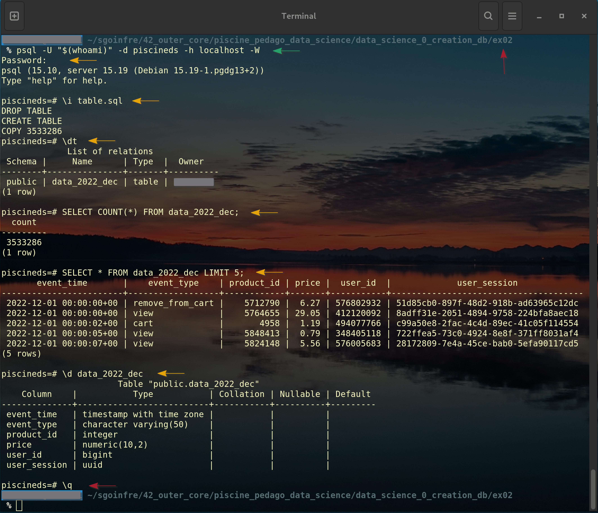
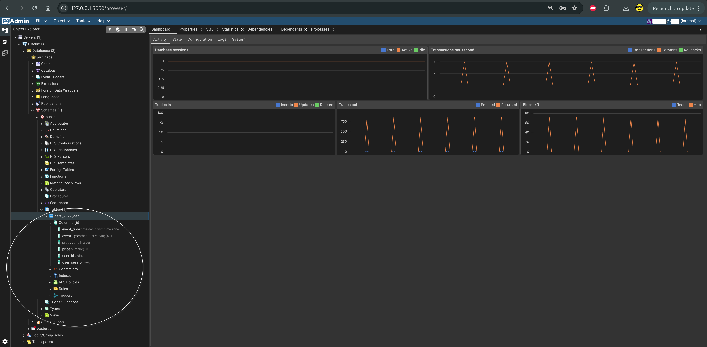

# 📄 Ejercicio 02 – First table

<p align="center">
  
</p>

[← Volver al README principal](../README.md)

---

## 🎯 ¿Qué se pide exactamente?

Crear **una sola tabla** en PostgreSQL a partir de **un archivo CSV** que se encuentra en la carpeta `customer/`.

### Condiciones obligatorias del subject

| Requisito | Detalle |
|-----------|---------|
| Nombre de la tabla | Exactamente el nombre del CSV **sin la extensión**<br>Ejemplo: `data_2022_dec.csv` → tabla `data_2022_dec` |
| Nombres de columnas | Deben coincidir **exactamente** con los del CSV |
| Primera columna | Debe ser de tipo fecha/hora (en PostgreSQL usamos `TIMESTAMPTZ`) |
| Tipos de datos | Debes usar **al menos 6 tipos de datos diferentes** |
| Tipos apropiados | No puedes poner todo como `TEXT`. Elige el tipo correcto para cada columna |

> ⚠️ **Importante:** Los tipos de datos de PostgreSQL **no son iguales** a los de MariaDB/MySQL. Investiga los correctos.

---

## 📁 Archivos a entregar

Dentro de `ex02/` debes entregar un archivo llamado `table.*`  
(puede ser `.sql`, `.py`, `.sh`… el que uses).

---

## 📦 Preparar el dataset

El CSV forma parte de los recursos del subject, dentro de la carpeta `customer/`.
Si todavía no lo tienes, abre el PDF o la página del proyecto en la intranet de 42,
descarga el paquete de datos y descomprímelo.

En este repositorio, el archivo usado por EX02 está en:

```text
../subject/customer/data_2022_dec.csv
```

Comprueba que el archivo existe y revisa su cabecera antes de cargarlo:

```bash
DATASET="../subject/customer/data_2022_dec.csv"
ls -lh "$DATASET"
head -n 3 "$DATASET"
```

Desde `ex02/`, copia el CSV al contenedor PostgreSQL. La ruta de la derecha es
la ruta **dentro del contenedor** y debe coincidir con el `COPY` de `table.sql`:

```bash
DATASET="../subject/customer/data_2022_dec.csv"
docker cp "$DATASET" \
  postgres_piscineds:/tmp/data_2022_dec.csv
```

Comprueba que Docker lo recibió y que no está vacío:

```bash
docker exec postgres_piscineds \
  ls -lh /tmp/data_2022_dec.csv
```

Si aparece un aviso de `Lchown` después de `docker cp`, comprueba primero este
último comando. Si el archivo aparece con un tamaño razonable, puedes continuar:
el aviso se refiere a permisos/propietario y no necesariamente ha impedido la copia.

---

## 🧠 Explicación sencilla

Un archivo CSV es como una hoja de Excel guardada en texto plano.  
Cada fila es un registro y cada columna es un tipo de información.

Crear una tabla es como preparar una estantería específica dentro del almacén:

- Decides el nombre de la estantería (`data_2022_dec`)
- Decides qué cajones tendrá (las columnas)
- Decides el tipo de cada cajón (número, texto, fecha…)
- Luego vuelcas el contenido del CSV dentro de esa estantería.

---

## 🚀 Cómo implementarlo paso a paso

### Paso 1: Mirar el contenido del CSV

Abre el archivo CSV (por ejemplo `data_2022_dec.csv`) y mira la **primera línea** (la cabecera).  

Cabecera de `data_2022_dec.csv`:

```
event_time,event_type,product_id,price,user_id,user_session
```

### Paso 2: Decidir los tipos de datos (mínimo 6 diferentes)

Aquí tienes una propuesta típica y correcta:

| Columna         | Tipo PostgreSQL     | Por qué |
|-----------------|---------------------|---------|
| event_time      | `TIMESTAMPTZ`       | Es una fecha y hora (obligatorio primero) |
| event_type      | `VARCHAR(50)`       | Texto corto |
| product_id      | `BIGINT`            | Número entero grande |
| category_id     | `BIGINT`            | Número entero grande |
| category_code   | `VARCHAR(255)`      | Texto más largo |
| brand           | `VARCHAR(100)`      | Texto medio |
| price           | `NUMERIC(10,2)`     | Número con decimales (precio) |
| user_id         | `BIGINT`            | Número entero grande |
| user_session    | `UUID` o `VARCHAR`  | Identificador de sesión |

En `data_2022_dec` se usan exactamente seis tipos diferentes, cumpliendo el mínimo exigido.

### Paso 3: Crear el script

#### Opción A – Script SQL puro (recomendado para empezar)

Crea el archivo `ex02/table.sql`:

#### 📘 Guía SQL paso a paso: [SQL.md](./SQL.md) <- Recomendable

```sql
-- Borrar la tabla si ya existe (útil para pruebas)
DROP TABLE IF EXISTS data_2022_dec;

-- Crear la tabla
CREATE TABLE data_2022_dec (
    event_time    TIMESTAMPTZ,     -- cuándo ocurrió el evento
    event_type    VARCHAR(50),     -- tipo de acción (view, cart, ...)(ver, carrito, ...)
    product_id    INTEGER,         -- identificador del producto
    price         NUMERIC(10,2),   -- precio del producto
    user_id       BIGINT,          -- identificador del usuario
    user_session  UUID             -- identificador de la sesión
);

-- Importar los datos de forma rápida y eficiente
COPY data_2022_dec (
    event_time, 
    event_type, 
    product_id, 
    price, 
    user_id, 
    user_session
)

FROM '/tmp/data_2022_dec.csv'

WITH (
    FORMAT csv, 
    HEADER true
); 
```

#### Opción B – Script Python (más flexible, pero no presente en este caso)

Puedes usar `psycopg2` + `pandas` o solo `psycopg2`.

### Paso 4: Ejecutar el script

Hay dos formas equivalentes. Elige una; no es necesario ejecutar ambas.

#### Opción A: desde el host

Como el CSV ya está dentro del contenedor y `table.sql` usa esa ruta interna:

```bash
psql -U "$(whoami)" -d piscineds -h localhost -W

# Después, dentro de psql:

\i table.sql
```

También puedes ejecutar el archivo directamente desde la terminal, estando en `ex02/`:

```bash
psql -U "$(whoami)" -d piscineds -h localhost -W -f table.sql
```

#### Opción B: ejecutar todo dentro del contenedor

Esta opción copia también el SQL al contenedor y lo ejecuta allí:

```bash
docker cp "$PWD/table.sql" postgres_piscineds:/tmp/table.sql
docker exec postgres_piscineds ls -lh /tmp/table.sql
docker exec -it postgres_piscineds \
  psql -U "$(whoami)" -d piscineds -W -f /tmp/table.sql
```

La salida esperada incluye `DROP TABLE`, `CREATE TABLE` y `COPY` seguido del
número de filas cargadas. Si reejecutas el script, el `DROP TABLE IF EXISTS`
permite empezar de nuevo sin dejar la tabla anterior.

> `\i` ejecuta un archivo SQL desde el cliente `psql`; no sirve para abrir un
> CSV. El CSV se carga mediante el `COPY` que está dentro de `table.sql`.

### Paso 5: Verificar

```sql
-- Ver que la tabla existe
\dt

-- Contar las filas
SELECT COUNT(*) FROM data_2022_dec;

-- Ver las primeras filas
SELECT * FROM data_2022_dec LIMIT 5;

-- Ver la estructura de la tabla
\d data_2022_dec
```
<br>
<p align="center">
  
</p>

## 💡 Consejos importantes

1. **Usa siempre `COPY`** en vez de `INSERT` fila a fila. Es muchísimo más rápido.
2. La ruta del CSV debe ser accesible desde el servidor PostgreSQL: en este caso, `/tmp/data_2022_dec.csv` dentro del contenedor.
3. Si hay valores vacíos o nulos, PostgreSQL los acepta si la columna no tiene `NOT NULL`.
4. Para datasets grandes, comprueba primero la ruta y la cabecera antes de iniciar la carga.

---

## ✅ Checklist de este ejercicio

- [ ] La tabla se llama exactamente como el CSV (sin `.csv`)
- [ ] La primera columna es `TIMESTAMPTZ`
- [ ] Hay al menos 6 tipos de datos diferentes
- [ ] Los nombres de las columnas coinciden con el CSV
- [ ] Los datos se han importado correctamente
- [ ] El CSV está dentro del contenedor en `/tmp/data_2022_dec.csv`
- [ ] El archivo se llama `table.*`

<br>
<p align="center">
  
</p>

---

## 🔗 Navegación

- [← README principal](../README.md)
- [← Ejercicio anterior: ex01](../ex01/README.md)
- [Siguiente ejercicio: ex03 →](../ex03/README.md)

---

*Piscine Data Science – sternero – 42 Málaga – Septiembre de 2026*