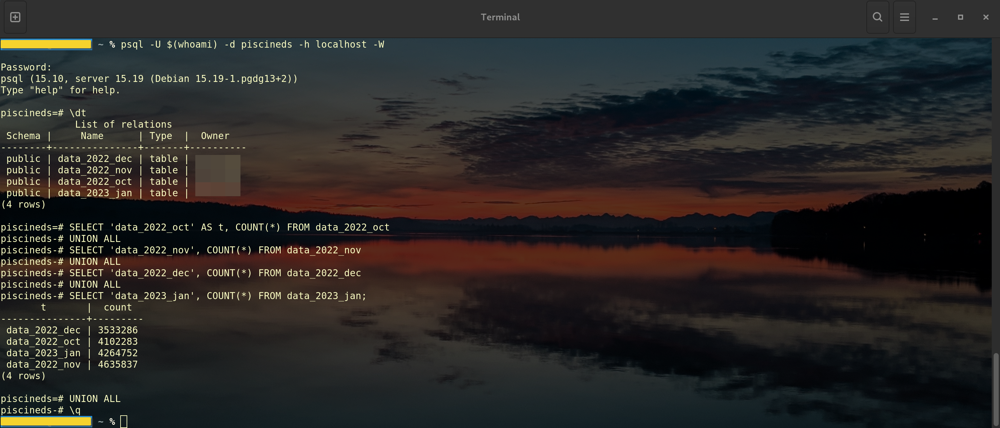
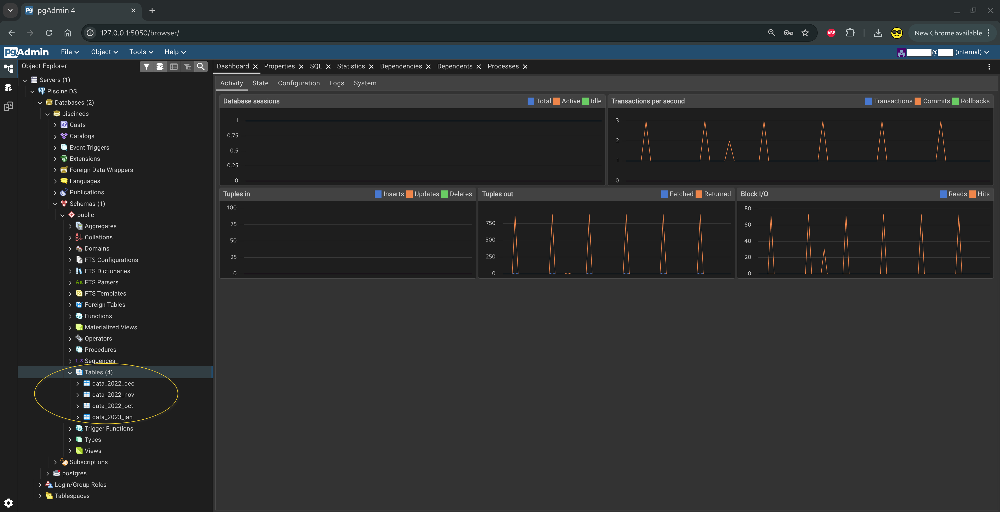

# 🤖 Ejercicio 03 – Automatic table

<p align="center">
  
</p>

[← Volver al README principal](../README.md)

---

<a id="indice"></a>
## 📑 Índice

1. [¿Qué se pide exactamente?](#que-se-pide)
2. [Archivos a entregar](#archivos-a-entregar)
3. [Explicación sencilla](#explicacion-sencilla)
4. [Estructura de carpetas](#estructura-carpetas)
5. [Cómo implementarlo](#como-implementarlo)
6. [Asistente interactivo (start.sh)](#asistente-startsh)
7. [Ejecutar el script (paso a paso)](#ejecutar-script)
8. [Comprobar el resultado](#comprobar-resultado)
9. [Puntos clave “automático”](#puntos-clave)
10. [Diagrama de flujo](#diagrama-flujo)
11. [Errores frecuentes](#errores-frecuentes)
12. [Checklist](#checklist)
13. [Navegación](#navegacion)

---

<a id="que-se-pide"></a>
## 🎯 ¿Qué se pide exactamente?

Crear **automáticamente** una tabla por **cada archivo CSV** de la carpeta `customer/`.

### Condiciones (subject)

| Requisito | Detalle |
|-----------|---------|
| Origen | Todos los `.csv` de `customer/` |
| Descubrimiento | **Automático** (prohibido hardcodear nombres) |
| Nombre de tabla | Nombre del CSV **sin** la extensión (ej. `data_2022_oct`) |
| Tipos | Mismas reglas que **EX02**: 1ª columna fecha/hora, ≥ 6 tipos, nombres exactos, tipos apropiados |
| Entrega | `ex03/automatic_table.*` |

[↑ Volver al índice](#indice)

---

<a id="archivos-a-entregar"></a>
## 📁 Archivos a entregar

Dentro de `ex03/`:

```text
automatic_table.*    # .py, .sh, … el que uses
```

En este repo la opción recomendada es:

| Archivo | Rol |
|---------|-----|
| [`automatic_table.py`](./automatic_table.py) | Script que lista CSV, crea tablas y carga datos |
| [`start.sh`](./start.sh) | Asistente interactivo (entorno + carga + comprobación); **no sustituye** a `automatic_table.*` |
| [`python.md`](./python.md) | Guía didáctica del script (útil, **no entregable**) |

[↑ Volver al índice](#indice)

---

<a id="explicacion-sencilla"></a>
## 🧠 Explicación sencilla

En **EX02** montaste **una** estantería a mano.

En **EX03** el robot:

1. Entra en el almacén (`customer/`)
2. Lee el nombre de todas las cajas (`.csv`)
3. Por cada una monta una estantería y vacía la caja (`CREATE` + `COPY`)

Si mañana hay 50 CSV, el mismo programa los procesa sin cambiar nombres en el código.

[↑ Volver al índice](#indice)

---

<a id="estructura-carpetas"></a>
## 📂 Estructura de carpetas esperada

```text
.
├── customer/
│   ├── data_2022_dec.csv
│   ├── data_2022_nov.csv
│   ├── data_2022_oct.csv
│   └── data_2023_jan.csv
└── items/
    └── items.csv
```

> En muchos proyectos del campus los CSV están en `subject/customer/`.  
> El script debe encontrar la carpeta con **rutas relativas** o un argumento, no con rutas absolutas de un solo usuario.

Cabecera real de estos CSV (las cuatro coinciden):

```text
event_time,event_type,product_id,price,user_id,user_session
```

[↑ Volver al índice](#indice)

---

<a id="como-implementarlo"></a>
## 🚀 Cómo implementarlo

### ¿Python u otra opción?

El subject acepta `automatic_table.*` (Python, Bash, etc.).

| Opción | Ventajas | Inconvenientes |
|--------|----------|----------------|
| **Python (`.py`)** | Claro, `pathlib` + bucle, `copy_expert` rápido | Hace falta `psycopg2` (instalable sin sudo) |
| Bash + `psql` | Pocas dependencias si ya tienes cliente | Más frágil con rutas y comillas |
| Solo SQL | No lista ficheros del disco de forma portable | No recomendable para EX03 |

**Recomendación:** Python.

### Qué hace `automatic_table.py` (resumen)

1. Instala dependencias si faltan (`psycopg2-binary`, `python-dotenv`)
2. Lee credenciales de `ex00/.env` (sin hardcodear la contraseña en el código)
3. Localiza `customer/` (varias rutas candidatas o argumento CLI)
4. `glob("*.csv")` → lista automática
5. Por cada archivo: `DROP` + `CREATE` (tipos EX02) + `COPY`

📘 Detalle línea a línea y conceptos de Python: **[python.md](./python.md)**

### Opción alternativa: Bash + `psql`

También válida: un `for` sobre `*.csv` y llamadas a `psql` / `docker exec`.  
Debe seguir siendo automático (sin nombres fijos de ficheros).

[↑ Volver al índice](#indice)

---

<a id="asistente-startsh"></a>
## 🎛️ Asistente interactivo (start.sh)

Además del script del subject, este repo incluye un asistente opcional:

```bash
cd ruta/a/data_science_0_creation_db/ex03
chmod +x start.sh
./start.sh
```

También se puede lanzar **desde cualquier directorio**:

```bash
/ruta/completa/a/ex03/start.sh
```

### Qué hace

| Capacidad | Detalle |
|-----------|---------|
| Cadena de arranque | Puede llamar a **EX01/start.sh**, que a su vez puede llamar a **EX00/start.sh** |
| Comprobaciones | Docker, `ex00/.env`, contenedor `postgres_piscineds`, `pg_isready`, `automatic_table.py`, carpeta `customer/` |
| Carga | Ejecuta `automatic_table.py` (con confirmación) |
| Verificación | `\dt`, `COUNT(*)` de tablas `data_*`, abrir `psql` |
| Seguridad | **No borra datos**; un reset total solo si lo haces tú en EX00 (`docker-compose down -v`) |

### Menú (resumen)

```text
— Preparación —
1) Comprobar entorno
2) Ejecutar EX01/start.sh (→ EX00)

— Carga de datos —
3) Localizar customer/ y contar CSV
4) Ejecutar automatic_table.py

— Comprobación —
5) Listar tablas (\dt)
6) COUNT(*) de tablas data_*
7) Abrir psql

q) Salir
```

Al inicio pregunta si quieres el **preflight** (comprobaciones). Si dices que no, vas directo al menú.

> `start.sh` **no sustituye** a `automatic_table.*` en la entrega del subject: es una ayuda de flujo de trabajo.

[↑ Volver al índice](#indice)

---

<a id="ejecutar-script"></a>
## ▶️ Ejecutar el script (paso a paso)

Rutas genéricas: sustituye la base del proyecto por la tuya si es distinta.

### 1. PostgreSQL arriba

```bash
docker ps
```

Debes ver `postgres_piscineds` en estado *Up*.

Si no:

```bash
cd ruta/a/data_science_0_creation_db/ex00
docker-compose up -d
```

(o usa `./start.sh` → opción 2 / arranque del contenedor).

### 2. Existe `ex00/.env`

```bash
cat ruta/a/data_science_0_creation_db/ex00/.env
```

Ejemplo esperado:

```text
POSTGRES_USER=tu_login
POSTGRES_PASSWORD=mysecretpassword
POSTGRES_DB=piscineds
```

### 3. Lanzar el script

```bash
cd ruta/a/data_science_0_creation_db/ex03
python3 automatic_table.py
```

Otras formas equivalentes:

```bash
# Ejecutable (si tiene shebang y permisos)
chmod +x automatic_table.py
./automatic_table.py

# Si no encuentra customer/ automáticamente
python3 automatic_table.py ../subject/customer
python3 automatic_table.py /ruta/completa/a/customer

# Desde el asistente
./start.sh   # opción 4
```

### Qué esperar en pantalla

- Ruta de la carpeta `customer/` encontrada  
- Mensaje del estilo “Se encontraron 4 CSV” (o el número que haya)  
- Por cada archivo: progreso y confirmación de tabla creada  
- “Proceso terminado”

Los CSV son grandes: la importación puede tardar **varios minutos**. Es normal.

### Dependencias (si hace falta instalar a mano)

```bash
python3 -m pip install --user psycopg2-binary python-dotenv
```

El propio script intenta instalarlas si faltan (necesita red y `pip` de usuario).

[↑ Volver al índice](#indice)

---

<a id="comprobar-resultado"></a>
## ✅ Comprobar el resultado

**Desde el host (localhost):**

```bash
psql -U $(whoami) -d piscineds -h localhost -W
```

**Desde dentro del contenedor:**

```bash
docker exec -it postgres_piscineds \
  psql -U "$(whoami)" -d piscineds -W
```

Contraseña del subject: `mysecretpassword`

Dentro de `psql` (**un comando cada vez**):

```sql
\dt
```

Debes ver al menos:

```text
 data_2022_dec
 data_2022_nov
 data_2022_oct
 data_2023_jan
```

Luego:

```sql
SELECT 'data_2022_oct' AS t, COUNT(*) FROM data_2022_oct
UNION ALL
SELECT 'data_2022_nov', COUNT(*) FROM data_2022_nov
UNION ALL
SELECT 'data_2022_dec', COUNT(*) FROM data_2022_dec
UNION ALL
SELECT 'data_2023_jan', COUNT(*) FROM data_2023_jan;
```

- `COUNT(*)` cuenta las filas de cada tabla.  
- `UNION ALL` apila los resultados de varias consultas **sin** eliminar filas repetidas.

Ejemplo de forma de la salida (los números **cambian** según el dataset):

<p align="center">
  
</p>

> **Importante:** el orden de las filas del `UNION ALL` puede variar.  
> Para validar EX03 solo importa que las **cuatro tablas existan** y que cada `COUNT(*)` sea **> 0**.  
> Si quieres un orden estable:
>
> ```sql
> SELECT 'data_2022_oct' AS t, COUNT(*) FROM data_2022_oct
> UNION ALL
> SELECT 'data_2022_nov', COUNT(*) FROM data_2022_nov
> UNION ALL
> SELECT 'data_2022_dec', COUNT(*) FROM data_2022_dec
> UNION ALL
> SELECT 'data_2023_jan', COUNT(*) FROM data_2023_jan
> ORDER BY 1;
> ```


Muestra de filas:

```sql
SELECT * FROM data_2022_oct LIMIT 3;
```

Salir:

```sql
\q
```

También puedes revisar las tablas en **pgAdmin** (EX01) ...

<p align="center">
  
</p>

o también puedes revisarlas con las opciones 5–7 de `./start.sh`.

[↑ Volver al índice](#indice)

---

<a id="puntos-clave"></a>
## 📝 Puntos clave para que sea “automático”

1. Usa `Path.glob("*.csv")`, `os.listdir()` o equivalente.  
2. Nombre de tabla con `.stem` / `os.path.splitext()` (sin extensión).  
3. **Nunca** escribas en el código `data_2022_oct`, `data_2022_nov`, etc.  
4. Tipos alineados con la cabecera real y con EX02.  
5. Carga masiva (`COPY` / `copy_expert`), no miles de `INSERT`.

[↑ Volver al índice](#indice)

---

<a id="diagrama-flujo"></a>
## 🗺️ Diagrama de flujo

<p align="center">
  
</p>

Resumen del flujo:

```text
Inicio → dependencias → .env → localizar customer/
  → listar *.csv → para cada CSV: DROP + CREATE + COPY → fin
```

[↑ Volver al índice](#indice)

---

<a id="errores-frecuentes"></a>
## 🛠️ Errores frecuentes

| Síntoma | Qué hacer |
|---------|-----------|
| No encuentra `customer/` | `python3 automatic_table.py ../subject/customer` |
| `connection refused` | `docker-compose up -d` en `ex00/` o `./start.sh` |
| Error de autenticación | Revisar `ex00/.env` (usuario = login, password del subject) |
| `ModuleNotFoundError` | `pip install --user psycopg2-binary python-dotenv` |
| Pylance: import unresolved | Aviso del editor; no impide ejecutar si el paquete está en el Python de la terminal |
| Tarda mucho | Normal con CSV de cientos de MB |

[↑ Volver al índice](#indice)

---

<a id="checklist"></a>
## ✅ Checklist de este ejercicio

| Requisito | ¿Hecho? |
|-----------|---------|
| El script encuentra solo los CSV de `customer/` | ☐ |
| Crea una tabla por cada CSV | ☐ |
| Nombre de tabla = archivo sin `.csv` | ☐ |
| Sin nombres de archivos hardcodeados | ☐ |
| Tipos según reglas de EX02 | ☐ |
| Archivo `automatic_table.*` en `ex03/` | ☐ |
| `COUNT(*)` > 0 en cada tabla | ☐ |

**Resultado esperado al validar:** 4 tablas (`data_2022_*` / `data_2023_jan`) con filas cargadas.

[↑ Volver al índice](#indice)

---

<a id="navegacion"></a>
## 🔗 Navegación

- [← README principal](../README.md)
- [← Ejercicio anterior: ex02](../ex02/README.md)
- [📘 Guía Python](./python.md)
- [🎛️ start.sh](./start.sh)
- [Siguiente ejercicio: ex04 →](../ex04/README.md)

---

*Piscine Data Science – sternero – 42 Málaga – Septiembre de 2026*
