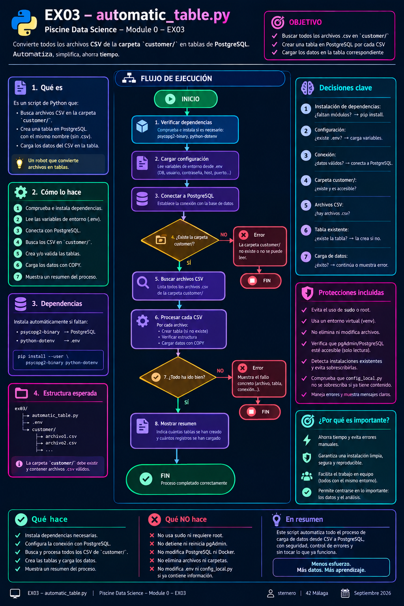

# 🐍 Guía Python – EX03 Automatic table

<p align="center">
  
</p>

[← Volver al README de EX03](README.md) · [← README principal](../README.md)

---

## 📑 Índice

1. [¿Para quién es esta guía?](#-para-quién-es-esta-guía)
2. [El objetivo de esta guía](#-el-objetivo-de-esta-guía)
3. [¿Qué es Python? (sin asumir nada)](#-qué-es-python-sin-asumir-nada)
4. [Por qué Python en EX03](#-por-qué-python-en-ex03)
5. [Cómo se ejecuta un script](#-cómo-se-ejecuta-un-script)
6. [Ideas básicas del lenguaje](#-ideas-básicas-del-lenguaje)
7. [Analogía del robot y las cajas](#-analogía-del-robot-y-las-cajas)
8. [Estructura de `automatic_table.py`](#-estructura-de-automatic_tablepy)
9. [Bloque a bloque (recorrido guiado)](#-bloque-a-bloque-recorrido-guiado)
10. [Dependencias: psycopg2 y dotenv](#-dependencias-psycopg2-y-dotenv)
11. [Rutas y la carpeta `customer/`](#-rutas-y-la-carpeta-customer)
12. [Conexión a PostgreSQL](#-conexión-a-postgresql)
13. [Crear tabla y cargar CSV](#-crear-tabla-y-cargar-csv)
14. [El bucle automático (corazón de EX03)](#-el-bucle-automático-corazón-de-ex03)
15. [Cómo ejecutar el script](#-cómo-ejecutar-el-script)
16. [Cómo comprobar el resultado](#-cómo-comprobar-el-resultado)
17. [Avisos del editor (Pylance)](#-avisos-del-editor-pylance)
18. [Errores frecuentes](#-errores-frecuentes)
19. [Checklist del subject](#-checklist-del-subject)
20. [Diagrama de flujo](#-diagrama-de-flujo)
21. [Mini glosario](#-mini-glosario)
22. [Navegación](#-navegación)

---

## 👋 ¿Para quién es esta guía?

Para cualquier persona de la **Piscine Data Science** en 42 que:

- vaya a hacer **EX03 – Automatic table**,
- Tenga una pequeña **base de programación en Python** (o sepa muy poco),
- necesite entender el archivo `automatic_table.py` línea a línea,
- quiera una referencia clara, sin jerga innecesaria.

No hace falta haber estudiado un curso súper avanzado de Python.  
Sí hace falta tener **ex00** y **ex02** (PostgreSQL) funcionando y haber entendido la idea de **ex02** (una tabla desde un CSV).

[↑ Volver al índice](#-índice)

---

## 🎯 El objetivo de esta guía

Al terminarla deberías poder:

1. Explicar **qué es** un script de Python en una frase.  
2. Entender las piezas de `automatic_table.py` sin miedo.  
3. Saber **por qué** no hardcodeamos los nombres de los CSV.  
4. Ejecutar el script y **comprobar** las tablas en PostgreSQL.  
5. Relacionar cada bloque del código con el **subject** de EX03.

[↑ Volver al índice](#-índice)

---

## 💬 ¿Qué es Python? (sin asumir nada)

**Python** es un lenguaje de programación.

Y ya sabemos que un **lenguaje de programación** es una forma de dar instrucciones a un ordenador con reglas claras.

Un **script** es un archivo de texto (aquí, `automatic_table.py`) con esas instrucciones en orden.

Analogía:

| Vida cotidiana | En el ordenador |
|----------------|-----------------|
| Receta de cocina | Script `.py` |
| Cocinero | Intérprete `python3` |
| Plato terminado | Tablas creadas en PostgreSQL |

Y ya sabemos que cuando escribes:

```bash
python3 automatic_table.py
```

estás diciendo algo así como: *“Cocinero, sigue la receta de este archivo”*.

[↑ Volver al índice](#-índice)

---

## 🎓 Por qué Python en EX03

El subject pide un archivo `automatic_table.*` (puede ser `.py`, `.sh`, etc.).

Python es una opción excelente porque:

| Motivo | Detalle |
|--------|---------|
| Listar archivos | `Path.glob("*.csv")` encuentra todos los CSV solo |
| Nombres automáticos | `.stem` quita el `.csv` sin escribir nombres a mano |
| Hablar con PostgreSQL | librería `psycopg2` |
| Carga rápida | `copy_expert` ≈ `COPY` de SQL |
| Legible | el código se puede comentar y explicar bien |

Bash también es válido. En esta guía nos centramos en la versión **Python** del repo.

[↑ Volver al índice](#-índice)

---

## ▶️ Cómo se ejecuta un script

1. Abres una **terminal**.  
2. Te colocas en la carpeta del script (`cd .../ex03`).  
3. Lanzas:

```bash
python3 automatic_table.py
```

Opcional: **pasar la ruta** de `customer/` si no la encuentra solo:

```bash
python3 automatic_table.py ../subject/customer
```

También puedes hacer el archivo <i><b>medio ejecutable</b></i>:

```bash
chmod +x automatic_table.py
./automatic_table.py
```

Esto último funciona gracias a la primera línea del archivo: **`#!/usr/bin/env python3`**.

[↑ Volver al índice](#-índice)

---

## 🧱 Ideas básicas del lenguaje

No necesitas entender ni memorizar un completo manual de Python. <br>
Con estas ideas basta para leer el script...

### Variable

Una **caja con nombre** donde guardas un valor.

```python
table_name = "data_2022_dec"
```

### Función

Un **bloque de pasos con nombre**. La defines una vez y la reutilizas.

```python
def saludar():
    print("Hola")
```

- `def` = “definir función”  
- `-> None` = “no devuelve un valor; solo hace trabajo”

### Import

**Traer una caja de herramientas** ya hecha (módulo).

```python
import os
from pathlib import Path
```

### Lista

Una **fila de elementos**.

```python
csv_files = ["a.csv", "b.csv"]
```

### Diccionario

Una **agenda**: clave → valor.

```python
needed = {"psycopg2": "psycopg2-binary"}
```

### Bucle `for`

“**Para cada** elemento de la lista, haz esto”.

```python
for csv_file in csv_files:
    create_table_from_csv(csv_file)
```

Ese bucle es justo lo que hace “automático” el ejercicio.

### `if`

“**Si** se cumple la condición, ejecuta este bloque”.

### F-string

Texto con variables dentro:

```python
print(f"Tabla {table_name}")
```

### `with ... as ...`

Abrir un recurso (archivo, conexión) y **cerrarlo solo** al terminar, aunque haya error.

[↑ Volver al índice](#-índice)

---

## 🤖 Analogía del robot y las cajas

| Pieza del subject | En la analogía | En el código |
|-------------------|----------------|--------------|
| Carpeta `customer/` | Almacén de cajas | `find_customer_folder()` |
| Cada archivo `.csv` | Una caja | `csv_path` |
| Nombre sin `.csv` | Etiqueta de la estantería | `csv_path.stem` |
| `CREATE TABLE` | Montar la estantería | `create_sql` |
| `COPY` | Vaciar la caja en la estantería | `copy_expert` |
| Bucle sobre todos los CSV | El robot no para hasta acabar | `for csv_file in csv_files` |

[↑ Volver al índice](#-índice)

---

## 📂 Estructura de `automatic_table.py`

El archivo se lee **de arriba abajo**. Orden mental:

```text
1. Cabecera (shebang, UTF-8, descripción)
2. Imports básicos (os, sys, Path)
3. ensure_dependencies()  → instalar lo que falte
4. Imports de psycopg2 y dotenv
5. Rutas del proyecto + lectura del .env
6. find_customer_folder() → ¿dónde está customer/?
7. get_connection()       → teléfono a PostgreSQL
8. create_table_from_csv()→ una caja → una tabla
9. main()                 → orquesta todo
10. if __name__ == "__main__" → interruptor de arranque
```

[↑ Volver al índice](#-índice)

---

## 🔎 Bloque a bloque (recorrido guiado)

### Cabecera

- `#!/usr/bin/env python3` → permite `./automatic_table.py`  
- `# -*- coding: utf-8 -*-` → acentos y eñes bien  
- `""" ... """` → texto de ayuda al inicio (docstring del módulo)

### `ensure_dependencies()`

Antes de importar librerías “extra”, el script pregunta:

> ¿Tengo `psycopg2` y `dotenv`?

Si no, intenta:

```bash
python3 -m pip install --user psycopg2-binary python-dotenv
```

Así reduces fricción en el campus (sin `sudo`).

### Rutas `SCRIPT_DIR` y `PROJECT_DIR`

- `SCRIPT_DIR` = carpeta `ex03/`  
- `PROJECT_DIR` = carpeta del módulo (padre de `ex03/`)

Sirven para localizar `ex00/.env` y candidatos de `customer/` **sin** poner `/sgoinfre/students/tu_login/...` a mano.

### `find_customer_folder()`

Orden de búsqueda:

1. Ruta pasada por argumento (si la hay)  
2. `subject/customer`  
3. `customer` junto al proyecto  
4. `customer` dentro de `ex03/`

Si no encuentra ninguna → mensaje claro y `sys.exit(1)`.

### `create_table_from_csv()`

Para **un** CSV:

1. `table_name = csv_path.stem`  
2. `DROP TABLE IF EXISTS ...`  
3. `CREATE TABLE` con tipos de EX02 (6 columnas reales de tus CSV)  
4. `COPY` vía `copy_expert` (salta la cabecera con `next(f)`)

### `main()`

1. Mira si hay argumento  
2. Encuentra `customer/`  
3. `glob("*.csv")` + `sorted`  
4. Bucle `for` → llama a `create_table_from_csv` por cada archivo  

### Interruptor final

```python
if __name__ == "__main__":
    main()
```

Solo arranca la lógica si ejecutas **este** archivo directamente.

[↑ Volver al índice](#-índice)

---

## 📦 Dependencias: psycopg2 y dotenv

| Paquete pip | Módulo al importar | Para qué sirve |
|-------------|--------------------|----------------|
| `psycopg2-binary` | `psycopg2` | Conectar y hablar con PostgreSQL |
| `python-dotenv` | `dotenv` | Leer `ex00/.env` |

Instalación manual (si hace falta):

```bash
python3 -m pip install --user psycopg2-binary python-dotenv
```

[↑ Volver al índice](#-índice)

---

## 📁 Rutas y la carpeta `customer/`

El subject espera CSV en `customer/`.  
En muchos repos del campus la ruta real es:

```text
.../data_science_0_creation_db/subject/customer/
```

El script **no** debe depender de un login concreto.  
Por eso usa rutas relativas al propio archivo y, si hace falta, un argumento.

[↑ Volver al índice](#-índice)

---

## 🔌 Conexión a PostgreSQL

Lee del `.env` de EX00:

- `POSTGRES_USER`  
- `POSTGRES_PASSWORD`  
- `POSTGRES_DB`  

Valores del subject:

| Campo | Valor típico |
|-------|----------------|
| Host | `localhost` |
| Puerto | `5432` |
| Base | `piscineds` |
| Contraseña | `mysecretpassword` |
| Usuario | tu login de 42 |

Requisito previo: contenedor arriba (`docker ps` → `postgres_piscineds`).

[↑ Volver al índice](#-índice)

---

## 📋 Crear tabla y cargar CSV

Misma idea que EX02, repetida en bucle.

Esquema alineado con la cabecera real:

```text
event_time, event_type, product_id, price, user_id, user_session
```

Tipos (≥ 6 distintos; primera = fecha/hora):

| Columna | Tipo |
|---------|------|
| event_time | `TIMESTAMPTZ` |
| event_type | `VARCHAR(50)` |
| product_id | `INTEGER` |
| price | `NUMERIC(10,2)` |
| user_id | `BIGINT` |
| user_session | `UUID` |

Carga: `COPY ... FROM STDIN` mediante `copy_expert` (rápida y adecuada para millones de filas).

[↑ Volver al índice](#-índice)

---

## 🔁 El bucle automático (corazón de EX03)

Lo que **prohíbe** el subject es escribir a mano:

```python
# MAL (ejemplo de lo que NO hay que hacer)
crear("data_2022_oct.csv")
crear("data_2022_nov.csv")
...
```

Lo correcto:

```python
for csv_file in sorted(customer_dir.glob("*.csv")):
    create_table_from_csv(csv_file)
```

Si mañana hay 50 CSV, el mismo código los procesa sin cambiar los nombres en el fuente.

[↑ Volver al índice](#-índice)

---

## 🚀 Cómo ejecutar el script

### Antes

```bash
docker ps
# debe verse postgres_piscineds

# debe existir ex00/.env con USER / PASSWORD / DB
```

### Ejecutar

```bash
cd ruta/a/data_science_0_creation_db/ex03
python3 automatic_table.py
```

Si no encuentra `customer/`:

```bash
python3 automatic_table.py ../subject/customer
```

Los CSV son grandes: **varios minutos** de espera pueden ser normales.

[↑ Volver al índice](#-índice)

---

## ✅ Cómo comprobar el resultado

```bash
docker exec -it postgres_piscineds \
  psql -U "$(whoami)" -d piscineds -W
```

Dentro de `psql` (**un comando cada vez**):

```sql
\dt
```

```sql
SELECT 'data_2022_oct' AS t, COUNT(*) FROM data_2022_oct
UNION ALL
SELECT 'data_2022_nov', COUNT(*) FROM data_2022_nov
UNION ALL
SELECT 'data_2022_dec', COUNT(*) FROM data_2022_dec
UNION ALL
SELECT 'data_2023_jan', COUNT(*) FROM data_2023_jan;
```

```sql
\q
```

También puedes mirar las tablas en pgAdmin (EX01).

[↑ Volver al índice](#-índice)

---

## 💛 Avisos del editor (Pylance)

Mensajes del estilo:

```text
Import "psycopg2" could not be resolved
Import "dotenv" could not be resolved
```

Significan: **el editor** no ve esos paquetes en su entorno.  
No implican automáticamente que el script falle al ejecutarse en la terminal.

Solución habitual:

1. Instalar con `pip install --user ...`  
2. Seleccionar en el IDE el mismo intérprete Python que usas en la terminal  

[↑ Volver al índice](#-índice)

---

## 🛠️ Errores frecuentes

| Síntoma | Qué comprobar |
|---------|----------------|
| No encuentra `customer/` | Pasa la ruta como argumento |
| Connection refused | `docker ps` / `docker-compose up -d` |
| Password authentication failed | Contenido de `ex00/.env` |
| Module not found | `pip install --user psycopg2-binary python-dotenv` |
| Error de tipo UUID / fecha | Misma lógica que en EX02 |
| Tarda mucho | Normal con CSV de cientos de MB |

[↑ Volver al índice](#-índice)

---

## ☑️ Checklist del subject

- [ ] Archivo `ex03/automatic_table.*`  
- [ ] Descubre solo los `.csv` de `customer/`  
- [ ] Una tabla por CSV; nombre = archivo sin extensión  
- [ ] Sin nombres de ficheros hardcodeados  
- [ ] Tipos acordes a EX02 (1ª columna fecha/hora, ≥ 6 tipos)  
- [ ] Datos cargados (`COUNT(*)` > 0 en cada tabla)

[↑ Volver al índice](#-índice)

---

## 🗺️ Diagrama de flujo

El flujo completo del script está resumido así:

<p align="center">
  
</p>

Hay también una **imagen** de este diagrama en el repositorio (ver carpeta `ex03/` o `imgs/`) para descargar e imprimir o adjuntar a notas.

[↑ Volver al índice](#-índice)

---

## 📖 Mini glosario

| Término | Significado breve |
|---------|-------------------|
| Script | Archivo con instrucciones para el ordenador |
| Intérprete | Programa que ejecuta el script (`python3`) |
| Módulo / librería | Caja de herramientas reutilizable |
| Variable | Nombre que guarda un valor |
| Función | Bloque de pasos reutilizable |
| Lista | Colección ordenada de elementos |
| Diccionario | Colección clave → valor |
| Bucle | Repetir acciones para cada elemento |
| Path | Ruta de archivo o carpeta |
| `.stem` | Nombre de fichero sin extensión |
| `glob` | Buscar archivos por patrón (`*.csv`) |
| `COPY` / `copy_expert` | Carga masiva de datos en PostgreSQL |
| Hardcodear | Escribir valores fijos que deberían descubrirse solos |

[↑ Volver al índice](#-índice)

---

## 🔗 Navegación

- [← README de EX03](README.md)
- [← README principal](../README.md)
- [← EX02 / SQL.md](../ex02/SQL.md)
- [← EX00 / PostgreSQL](../ex00/postgresql.md)
- [← EX00 / Docker](../ex00/docker.md)
- [Siguiente: EX04 →](../ex04/README.md)

---

*Piscine Data Science – Module 0 – Guía Python EX03*  
sternero – 42 Málaga – Septiembre de 2026*
