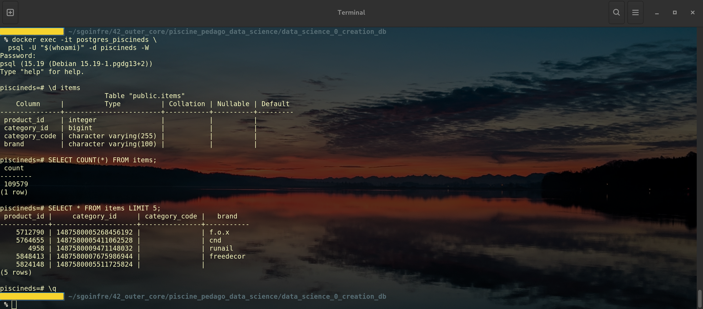
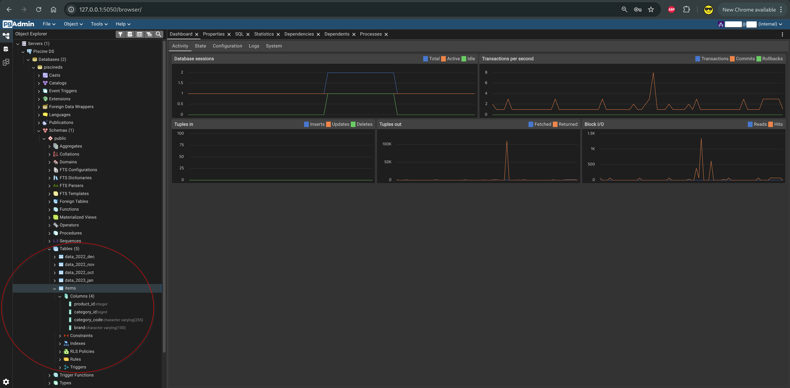

# 📦 Ejercicio 04 – Items table

<p align="center">
  
</p>

[← Volver al README principal](../README.md)

---

<a id="indice"></a>
## 📑 Índice

1. [¿Qué se pide exactamente?](#que-se-pide)
2. [Archivos a entregar](#archivos)
3. [Explicación sencilla](#explicacion)
4. [Datos reales del ejercicio](#datos-reales)
5. [Cómo implementarlo](#implementar)
6. [Asistente interactivo (start.sh)](#asistente)
7. [Ejecutar paso a paso](#ejecutar)
8. [Comprobar el resultado](#comprobar)
9. [Errores frecuentes](#errores)
10. [Checklist](#checklist)
11. [Navegación](#navegacion)

---

<a id="que-se-pide"></a>
## 🎯 ¿Qué se pide exactamente?

Crear una tabla llamada **`items`** a partir del CSV de productos del subject.

| Requisito | Detalle |
|-----------|---------|
| Archivo de origen | `item.csv` |
| Tabla | Exactamente **`items`** |
| Columnas | Igual que la cabecera del CSV |
| Tipos | Al menos **3** tipos distintos y apropiados |
| Entrega | `ex04/items_table.*` |

[↑ Volver al índice](#indice)

---

<a id="archivos"></a>
## 📁 Archivos a entregar

```text
items_table.*    # .sql, .py, .sh, …
```

En este repositorio:

| Archivo | Rol |
|---------|-----|
| [`items_table.sql`](./items_table.sql) | DDL: `DROP` + `CREATE TABLE items` |
| [`items_table.py`](./items_table.py) | Alternativa Python (crear + cargar en un paso) |
| [`start.sh`](./start.sh) | Asistente (opcional; **no sustituye** a `items_table.*`) |

Cualquiera de `.sql` o `.py` cumple el subject. Documentamos **ambos**.

[↑ Volver al índice](#indice)

---

<a id="explicacion"></a>
## 🧠 Explicación sencilla

EX02/EX03 trabajan con **eventos de clientes**.  
EX04 crea el **catálogo de productos**: cada fila es un artículo (`product_id`, categoría, marca).

Flujo:

1. Localizar el CSV  
2. Crear la tabla `items` con tipos adecuados  
3. Cargar los datos (`COPY` o `copy_expert`)  
4. Comprobar `\d items` y `COUNT(*)`

[↑ Volver al índice](#indice)

---

<a id="datos-reales"></a>
## 📂 Datos reales del ejercicio

Debido a su tamaño no está disponible en este repositorio. Habría que descargar:

```text
./subject/item/item.csv
```

(carpeta **`item`** en singular)

Cabecera:

```text
product_id,category_id,category_code,brand
```

Ejemplo de filas (`category_code` puede ir vacío):

```text
5712790,1487580005268456192,,f.o.x
5764655,1487580005411062528,,cnd
```

| Columna | Tipo SQL | Motivo |
|---------|----------|--------|
| `product_id` | `INTEGER` | Valores dentro del rango de entero |
| `category_id` | `BIGINT` | IDs muy grandes |
| `category_code` | `VARCHAR(255)` | Texto opcional |
| `brand` | `VARCHAR(100)` | Texto opcional |

→ Tres tipos: `INTEGER`, `BIGINT`, `VARCHAR`. Sin `NOT NULL` (hay vacíos).

[↑ Volver al índice](#indice)

---

<a id="implementar"></a>
## 🚀 Cómo implementarlo

### Opción A – SQL (`items_table.sql`) – Recomendable para ex04 

```sql
DROP TABLE IF EXISTS items;

CREATE TABLE items (
    product_id      INTEGER,
    category_id     BIGINT,
    category_code   VARCHAR(255),
    brand           VARCHAR(100)
);
```

La carga se hace después con `COPY` desde `/tmp/item.csv` dentro del contenedor  
(el host y el contenedor no comparten la misma ruta del CSV).

### Opción B – Python (`items_table.py`) – Igualmente válida

Mismo patrón que EX03:

1. Dependencias (`psycopg2`, `dotenv`)  
2. Leer `ex00/.env`  
3. Buscar `item.csv` (rutas candidatas o argumento)  
4. `DROP` + `CREATE` + `copy_expert`

```bash
python3 items_table.py
# o
python3 items_table.py ../subject/item/item.csv
```

[↑ Volver al índice](#indice)

---

<a id="asistente"></a>
## 🎛️ Asistente interactivo (start.sh)

```bash
cd ruta/a/ex04
chmod +x start.sh
./start.sh
```

| Capacidad | Detalle |
|-----------|---------|
| Cadena | Puede llamar a **EX03 → EX01 → EX00** |
| Carga | SQL+COPY **o** `items_table.py` |
| Comprobación | `\d items`, `COUNT(*)`, muestra, `psql` |
| Seguridad | No hace `down -v`; solo recrea `items` si eliges cargar de nuevo |

Menú (resumen): preparación (1–3) · carga SQL/Python (4–5) · verificación (6–9) · **q** salir.

[↑ Volver al índice](#indice)

---

<a id="ejecutar"></a>
## ▶️ Ejecutar paso a paso

### Ruta SQL

```bash
docker ps | grep postgres_piscineds

docker cp ./subject/item/item.csv postgres_piscineds:/tmp/item.csv
docker cp ./ex04/items_table.sql postgres_piscineds:/tmp/items_table.sql
# Aviso Lchown: si hubo "Successfully copied", se puede ignorar

docker exec -it postgres_piscineds \
  psql -U "$(whoami)" -d piscineds -W -f /tmp/items_table.sql

docker exec -it postgres_piscineds \
  psql -U "$(whoami)" -d piscineds -W -c \
  "COPY items FROM '/tmp/item.csv' WITH (FORMAT csv, HEADER true);"
```

Salida normal de la carga: `COPY 109579` (el número depende del CSV).

`NOTA: table "items" does not exist, skipping` en el primer `DROP` **no es error**.

<p align="center">
  
</p>

### Ruta Python

```bash
cd ex04
python3 items_table.py
```

### Desde start.sh

Opciones **4** (SQL) o **5** (Python).

[↑ Volver al índice](#indice)

---

<a id="comprobar"></a>
## ✅ Comprobar el resultado

```bash
docker exec -it postgres_piscineds \
  psql -U "$(whoami)" -d piscineds -W
```

```sql
\d items
SELECT COUNT(*) FROM items;
SELECT * FROM items LIMIT 5;
\q
```

También con pgAdmin (ver EX01) o en el menú de `./start.sh`.

<p align="center">
  
</p>

[↑ Volver al índice](#indice)

---

<a id="errores"></a>
## 🛠️ Errores frecuentes

| Síntoma | Qué hacer |
|---------|-----------|
| Ruta `subject/items/...` no existe | Usar `subject/item/item.csv` (singular) |
| NOTICE del DROP | Normal la primera vez |
| Lchown tras `Successfully copied` | Continuar; el fichero está en `/tmp` |
| `connection refused` | Arrancar EX00 / `./start.sh` |
| `ModuleNotFoundError` | `pip install --user psycopg2-binary python-dotenv` |

[↑ Volver al índice](#indice)

---

<a id="checklist"></a>
## ✅ Checklist de este ejercicio

| Requisito | ¿Hecho? |
|-----------|---------|
| CSV localizado (`subject/item/item.csv`) | ☐ |
| Tabla se llama exactamente `items` | ☐ |
| Columnas = cabecera del CSV | ☐ |
| ≥ 3 tipos de datos apropiados | ☐ |
| Datos cargados (`COUNT(*)` > 0) | ☐ |
| Archivo `items_table.*` en `ex04/` | ☐ |

**Resultado típico con el CSV de este repo:** ~109579 filas.

[↑ Volver al índice](#indice)

---

<a id="navegacion"></a>
## 🔗 Navegación

- [← README principal](../README.md)
- [← Ejercicio anterior: ex03](../ex03/README.md)
- [items_table.sql](./items_table.sql) · [items_table.py](./items_table.py) · [start.sh](./start.sh)

---

*Piscine Data Science – sternero – 42 Málaga – Septiembre de 2026*
